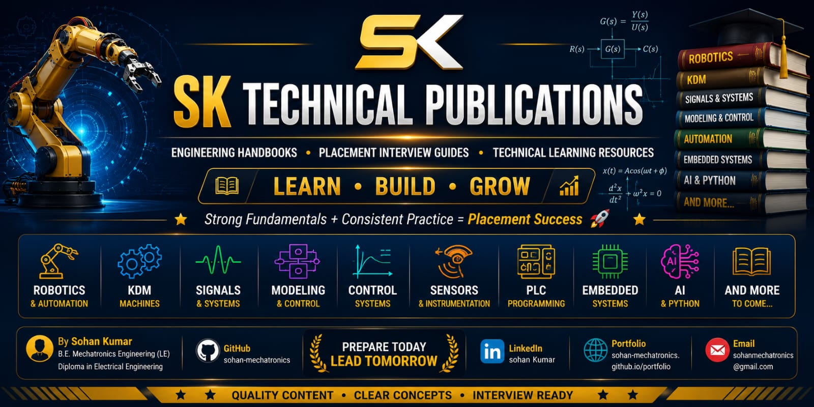

<p align="center">
  
</p>

---
# 📚 SK Technical Publications

> 🚀 Engineering Handbooks • Placement Interview Guides • Technical Learning Resources

Welcome to **SK Technical Publications** — a collection of self-curated engineering handbooks, placement interview guides, and technical learning resources created by **Sohan Kumar**.

> 🎯 **Mission:** Help engineering students strengthen technical fundamentals and prepare confidently for placements, technical interviews, university examinations, and quick revision.

---

# 📖 Available Publications

## 🤖 Robotics Placement Interview Handbook

### ✨ Highlights

- 📄 18 Chapters
- ❓ 350+ Interview Questions
- 📘 One-Liner Revision Notes
- 📊 Formula & Cheat Sheets
- 🎯 Placement Focused
- 🚀 Interview Ready

📂 **Folder:** Robotics Placement Interview Handbook

---

## ⚙️ Kinematics & Dynamics of Machines (KDM) Placement Interview Handbook

### ✨ Highlights

- 📄 12 Chapters
- ❓ 180+ Interview Questions
- 📐 Concept & Formula Based Learning
- 🎯 Placement Focused
- 🚀 Interview Ready

📂 **Folder:** KDM Placement Interview Handbook

---

# 🎯 Purpose

This repository is designed to help engineering students:

- 🎓 Crack Placement Interviews
- 💼 Prepare for Technical Interviews
- 📚 Revise Core Engineering Subjects
- 🧠 Strengthen Technical Fundamentals
- 🚀 Build Industry-Level Knowledge
- 💡 Improve Problem-Solving Skills

---

# 📂 Repository Structure

```text
SK-Technical-Publications
│
├── 🤖 Robotics Placement Interview Handbook
│
└── ⚙️ KDM Placement Interview Handbook
```

---

# 👨‍💻 Author

## 🎓 Sohan Kumar

- 🎓 B.E. Mechatronics Engineering (Lateral Entry)
- 🎓 Diploma in Electrical Engineering
- 🏛️ Chandigarh University

### 💡 Areas of Interest

- 🤖 Robotics
- ⚙️ Industrial Automation
- 🏭 PLC & SCADA
- 💻 Embedded Systems
- 🧠 Artificial Intelligence
- 🔧 Mechatronics Engineering

---

# 🚀 Upcoming Publications

- 📘 PLC Programming Handbook
- 📘 Industrial Automation Handbook
- 📘 Embedded Systems Handbook
- 📘 Sensors & Instrumentation Handbook
- 📘 Artificial Intelligence Handbook
- 📘 Python Programming Handbook
- 📘 Control Systems Handbook

---

# ⭐ Support

If this repository helped you, please consider giving it a ⭐ **Star**.

Your support motivates me to continue creating high-quality engineering handbooks and technical learning resources for students.

❤️ **Thank you for your support!**

---

# 📢 Disclaimer

📚 These publications are created solely for educational, learning, and placement preparation purposes.

---

# 🌟 SK Technical Publications

## 📖 Learn • Build • Grow

> 🚀 **Strong Fundamentals + Consistent Practice = Placement Success**

---

© **2026 Sohan Kumar** | **SK Technical Publications** | All Rights Reserved.